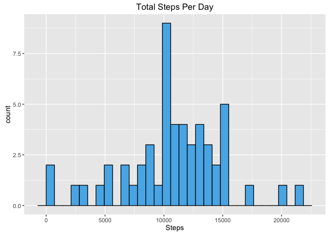
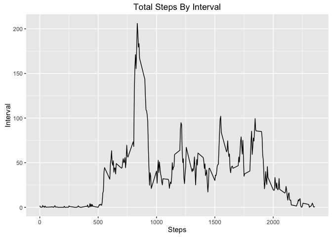
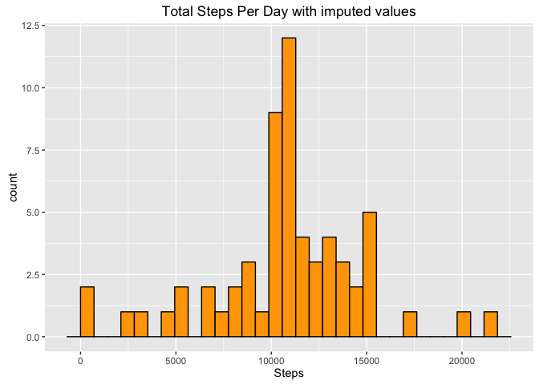
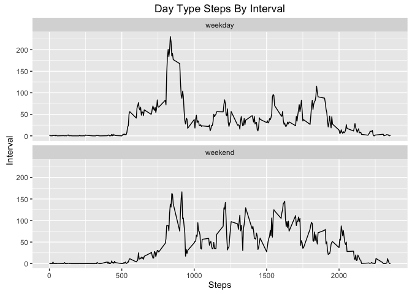

# Reproducible Research: Peer Assessment 1
scottodito  
June 5, 2016  

## Load in dependency libraries

1) require the dplyr lib for easy mods of data


```r
  require(dplyr)
```

2) require the ggplot2 lib for nice graphs


```r
  require(ggplot2)
```


## Loading and preprocessing the data

1) download the data if nessesary from url https://d396qusza40orc.cloudfront.net/repdata%2Fdata%2Factivity.zip


```r
unzip('activity.zip')
activity_table <- read.csv('activity.csv')
```

## Find the mean total number of steps taken per day?


```r
act_table <- tbl_df(activity_table)

steps_data_by_date <- group_by(act_table, date, na.rm=TRUE)
```


Mean total steps per day : 37.3825996


### Make a histogram of the total number of steps taken each day

1) Summaraize the steps by date and plot using ggplot


```r
summary_w_sum <- summarize_each(steps_data_by_date, funs(sum), steps)
ggplot(summary_w_sum, aes(steps)) +
  geom_histogram(fill = '#56B4E9', color = 'black') +
  ggtitle("Total Steps Per Day") +
  xlab("Steps") 
```



### The mean and median total number of steps taken per day


```r
options(scipen=999)
mean_val <- mean(summary_w_sum$steps, na.rm=TRUE)
median_val <- median(summary_w_sum$steps, na.rm=TRUE)
```

* Mean of total steps per day : 10766.1886792

* Median of total steps per day : 10765


## What is the average daily activity pattern?

### make a time series plot of the 5-minute interval and average steps taken across all days (y-axis)

1) First group by interval and filter out na's then summarize


```r
data_by_interval <- group_by(act_table, interval)
summary_by_interval <- data_by_interval %>% 
filter(!is.na(steps)) %>% 
summarize_each(funs(mean), steps)
```

2) Use the summary to plot the interval time series


```r
ggplot(summary_by_interval, aes(interval, steps)) +
geom_line() +
ggtitle("Total Steps By Interval") +
xlab("Steps") + ylab("Interval")
```



2) find the maximum steps per interval by arranging data (desc) and check first row


```r
row_with_most <- arrange(ungroup(data_by_interval), desc(as.numeric(steps)))[1,]
```

The 5-minute interval, on average across all the days in the dataset that contains the maximum number of steps: 615


## Imputing missing values

1) Finding the number of rows of missing values in the dataset (i.e. the total number of rows with NAs)


```r
naRows <- sum(apply(is.na(act_table), 1, any))
```

* Missing values in the dataset : 2304

2) Create a new dataset that is equal to the original dataset but with the missing data filled in. We do this by setting missing values to the mean for that specific interval using dplyr mutate.


```r
imputed_act_table <- act_table;

imputed_act_table <- imputed_act_table %>% 
  group_by(interval) %>% 
  mutate(steps = ifelse(is.na(steps), mean(steps, na.rm = TRUE), steps))
```

3) Histogram of the total number of steps taken each day and Calculate and report the mean and median total number of steps taken per day. 


```r
imputed_sum_by_date <- group_by(imputed_act_table, date)
summary_w_imputed_sum <- summarize_each(imputed_sum_by_date, funs(sum), steps)

ggplot(summary_w_imputed_sum, aes(steps)) +
  geom_histogram(fill = 'orange', color = 'black') +
  ggtitle("Total Steps Per Day with imputed values") +
  xlab("Steps") 
```




## Differences in activity patterns between weekdays and weekends

1) Create a new factor variable in the dataset with two levels -- "weekday" and "weekend" indicating whether a given date is a weekday or weekend day.


```r
imputed_act_table$date <- as.Date(as.character(imputed_act_table$date))
imputed_act_table_sum <- imputed_act_table %>% 
  mutate(day_type = ifelse((format(date, "%u") %in% c(6, 7)), 'weekend', 'weekday'))
imputed_act_table_sum$day_type <- as.factor(imputed_act_table_sum$day_type)
```

2) Panel plot containing a time series plot (i.e. type = "l") of the 5-minute interval (x-axis) and the average number of steps taken, averaged across all weekday days or weekend days (y-axis). 


```r
graph <- imputed_act_table_sum %>%
  group_by(interval, day_type) %>%
  summarise(steps = mean(steps))

ggplot(graph, aes(x = interval, y = steps)) +
  geom_line() +
  ggtitle("Day Type Steps By Interval") +
  xlab("Steps") + ylab("Interval") +
  facet_wrap(~day_type, ncol = 1)
```


